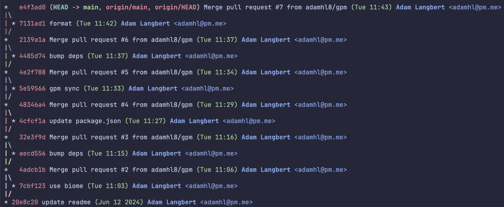
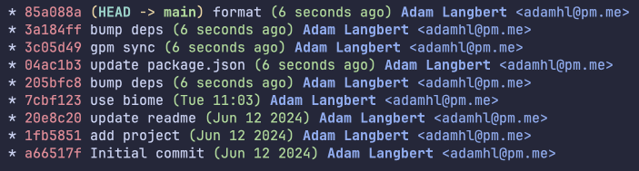

I was messing with some scripts that automatically created and then merged some PRs on some of my repos, and made the mistake of not turning off the "Allow merge commits" setting on GitHub.


Which gave me a commit history that looks like this:



Oops.

Googling how to fix this brings up a lot of answers about resetting then cherry picking the commits, and other solutions that are a bit of a pain.

Turn out you can use (abuse?) `git rebase` to make this really easy[^1].

Just run:

```sh
git rebase <most recent commit hash before the merge commits>
```

Which in my case would be: `git rebase 20e8c20`



Nice.

[^1]: https://stackoverflow.com/a/60277828
